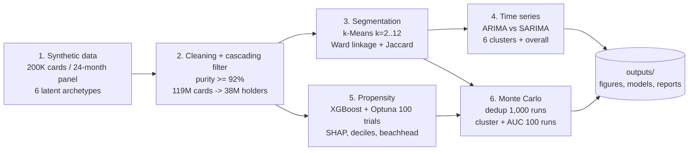
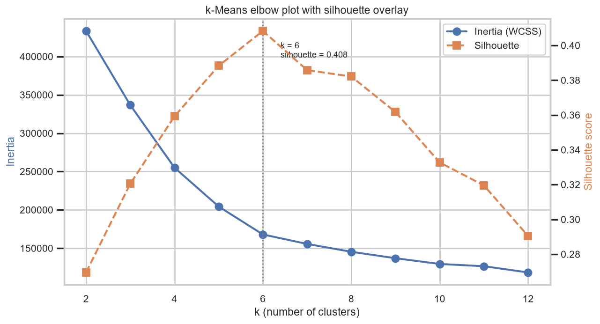
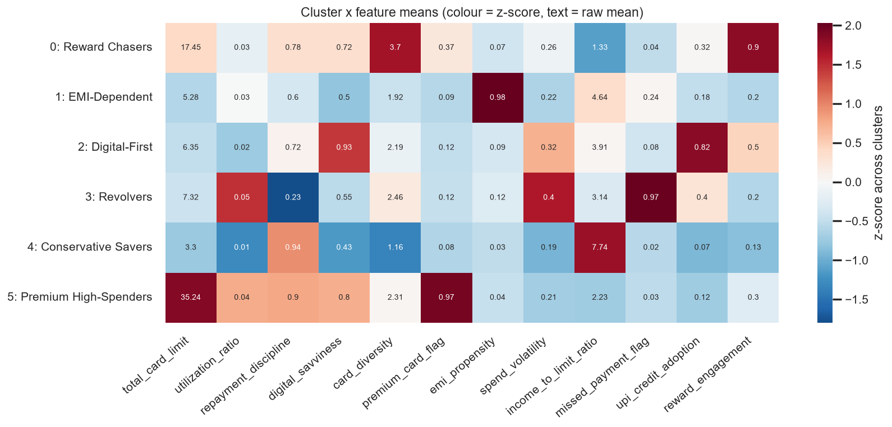
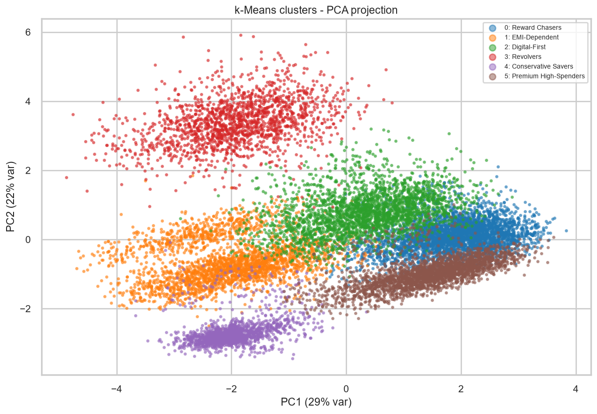
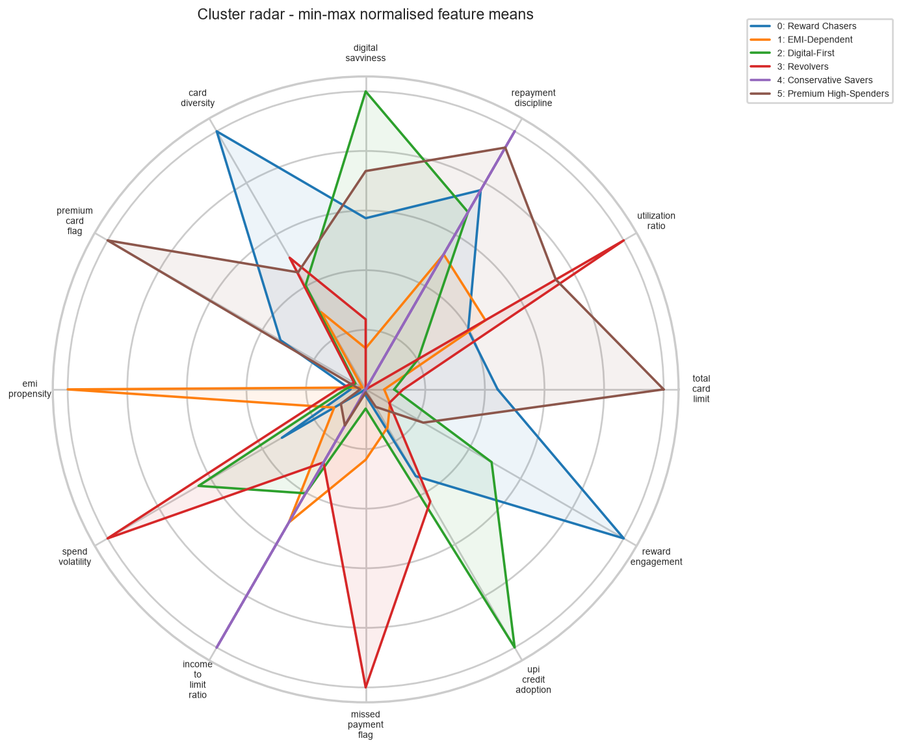
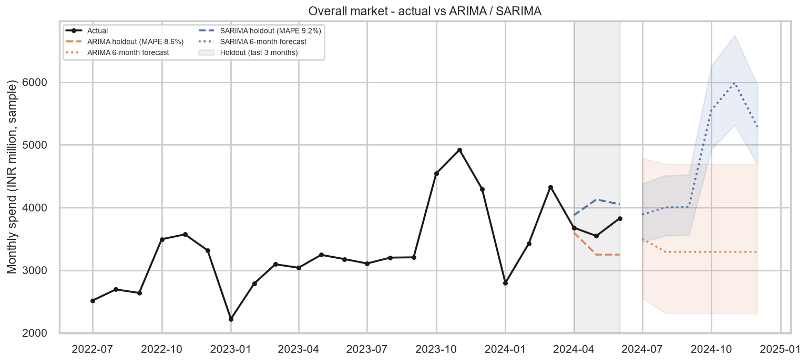
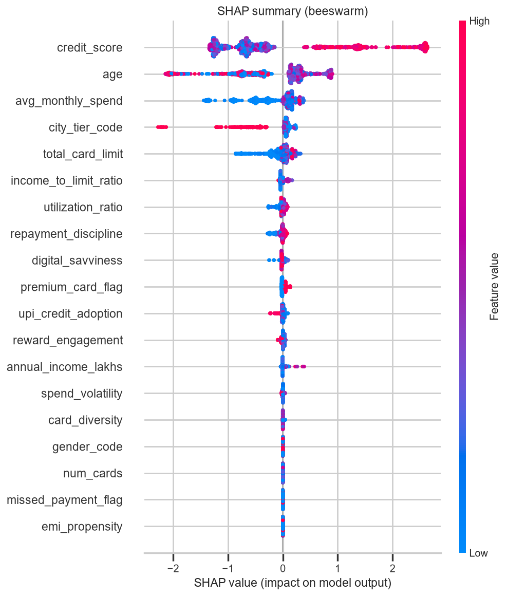
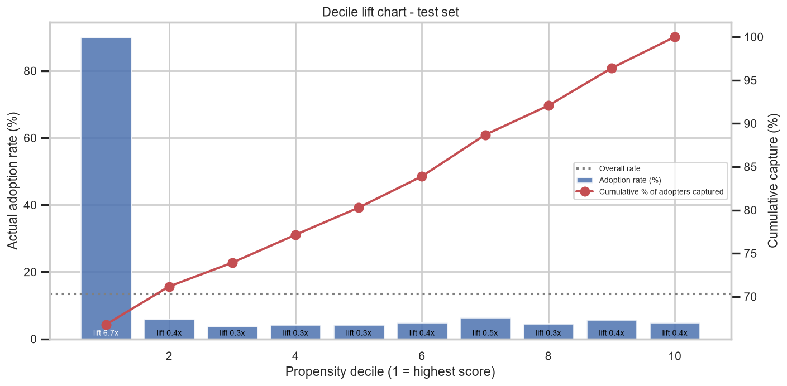
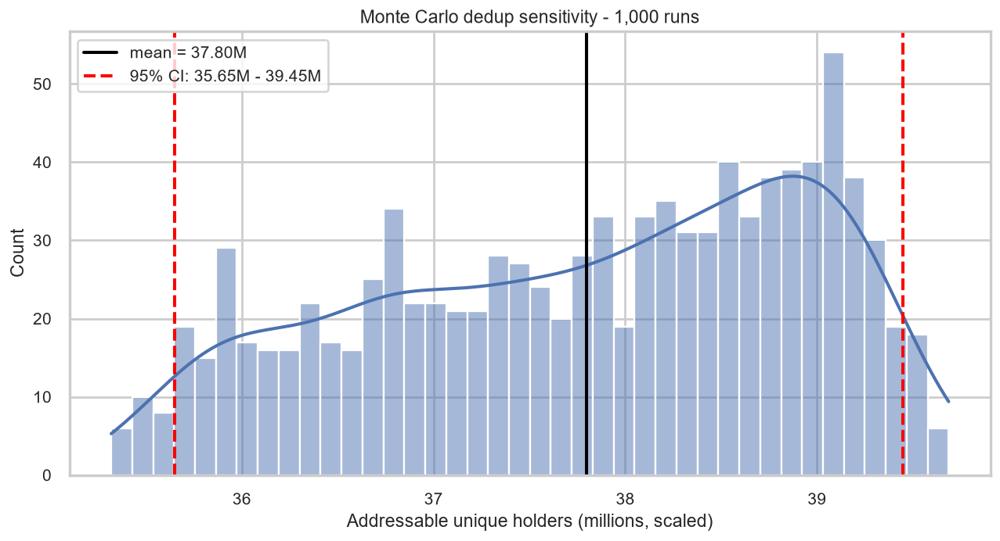

# CRED Market Entry and Segmentation Diagnostic


An independent, end-to-end machine-learning diagnostic of the Indian credit-card market built around CRED, the premium credit-card payments fintech. Starting from a synthetic but realistic card-level dataset that mirrors RBI, CIBIL, NPCI and CBDT patterns (119M cards / 38M unique holders), the project (1) deduplicates cards to addressable holders with a cascading market-sizing filter, (2) segments holders with k-Means validated by Ward hierarchical clustering, (3) forecasts segment spend with ARIMA / SARIMA, (4) trains an Optuna-tuned XGBoost propensity model with SHAP explainability to isolate the highest-intent beachhead cohort, and (5) stress-tests every headline number with Monte Carlo simulation.

Everything is generated, trained and plotted by one command. No real customer data is used anywhere.

---

## Key results

Numbers below are produced by `python run_pipeline.py` (seed 42) on the 200,000-card sample and scaled to the national market.

| Metric | Target | Achieved | Status |
|---|---|---|---|
| Data purity after cleaning | >= 92% | **97.5%** | PASS |
| Silhouette-optimal k | 6 | **k = 6** | PASS |
| Silhouette score at k = 6 | ~0.42 | **0.408** | PASS |
| k-Means vs Ward Jaccard | >= 0.75 | **0.967** | PASS |
| SARIMA holdout MAPE (overall market) | < 12% | **9.2%** | PASS |
| ARIMA holdout MAPE (overall market) | < 12% | **8.6%** | PASS |
| XGBoost ROC-AUC | >= 0.80 | **0.825** (logistic baseline 0.803) | PASS |
| Top-decile lift / adopter capture | capture >= 40% | **6.7x / 67%** | PASS |
| Beachhead cohort | 8-12M | **3.8M core, 11.4M with adjacent deciles** | PASS |
| Monte Carlo holder count, 95% CI (1,000 runs) | ~36.5-39.8M | **35.7M - 39.4M** | INFO |
| Monte Carlo cluster Jaccard, mean (100 runs) | >= 0.75 | **0.997** | PASS |
| Monte Carlo AUC, mean (100 runs) | - | **0.828** (95% CI 0.823-0.833) | INFO |

Full metric dump: [`outputs/reports/final_metrics.json`](outputs/reports/final_metrics.json) and [`outputs/reports/pipeline_summary.txt`](outputs/reports/pipeline_summary.txt).

---

## Pipeline architecture



---

## Installation and usage

```bash
git clone https://github.com/Shashank-Tiwari10/CRED-Market-Segmentation.git
cd CRED-Market-Segmentation
pip install -r requirements.txt
python run_pipeline.py            # full run, ~12 min on a laptop
```

Useful flags:

```bash
python run_pipeline.py --quick            # 40K-card smoke test (~4 min)
python run_pipeline.py --skip-generation  # reuse data/raw from a previous run
python run_pipeline.py --trials 30        # fewer Optuna trials
pytest tests/                             # unit tests (~30 s)
```

The pipeline prints a PASS/FAIL scorecard at the end and writes every artefact under `outputs/`. The notebooks in `notebooks/` reproduce each stage interactively; regenerate them with `python notebooks/build_notebooks.py` and execute with `jupyter nbconvert --execute --inplace notebooks/0*.ipynb` after a pipeline run.

Raw and processed CSVs are git-ignored (they are regenerated deterministically in under a minute); the trained models, reports and figures are committed.

---

## Project structure

```
CRED-Market-Segmentation/
├── README.md
├── requirements.txt
├── config.py                    # every tunable parameter and path
├── run_pipeline.py              # master script: runs all six stages
├── data/
│   ├── raw/                     # credit_cards_119M_sample.csv, monthly_spend_panel.csv.gz (generated)
│   ├── processed/               # holders_38M_sample.csv, features_engineered.csv, clustered_holders.csv
│   └── external/                # rbi_market_reference.csv (headline market figures)
├── notebooks/
│   ├── 01_data_generation.ipynb
│   ├── 02_eda_and_cleaning.ipynb
│   ├── 03_segmentation.ipynb
│   ├── 04_time_series.ipynb
│   ├── 05_propensity_model.ipynb
│   ├── 06_monte_carlo.ipynb
│   └── build_notebooks.py
├── src/
│   ├── data_generator.py        # Stage 1 - synthetic cards, holders, 24-month panel, noise injection
│   ├── preprocessing.py         # Stage 2 - cleaning, purity, cascading filter, 12 features
│   ├── segmentation.py          # Stage 3 - k-Means sweep, Ward linkage, Jaccard
│   ├── time_series.py           # Stage 4 - ARIMA / SARIMA grid search and holdout evaluation
│   ├── propensity.py            # Stage 5 - labels, Optuna-XGBoost, SHAP, deciles, beachhead
│   ├── monte_carlo.py           # Stage 6 - dedup, cluster and AUC sensitivity
│   ├── visualization.py         # every figure
│   └── utils.py                 # logging, seeding, metrics helpers
├── outputs/
│   ├── figures/                 # 27 PNGs
│   ├── models/                  # xgboost_propensity.pkl, optuna_study.pkl, shap_explainer.pkl, kmeans_k6.pkl
│   └── reports/                 # CSV / JSON metric tables
└── tests/
    ├── test_preprocessing.py
    ├── test_segmentation.py
    └── test_propensity.py
```

---

## Methodology

### Stage 1 - Synthetic data generation

* **Scale.** 200,000 card rows representing 119M cards in force (RBI FY24-25); ~64,500 holders at 3.1 cards per holder, so the sample maps 1:595 to the market.
* **Marginals** follow the brief: age N(35, 10) clipped 21-70, 65/35 gender split, Tier-1/2/3 at 45/35/20%, log-normal income, credit score N(720, 60), issuer shares HDFC 28% / SBI 22% / ICICI 18% / Axis 12% / Kotak 8% / others 12%, card limits tied to monthly income, spend tied to limit.
* **Six latent archetypes** (Premium High-Spenders, Reward Chasers, EMI-Dependent, Conservative Savers, Digital-First, Revolvers) are drawn per holder. Behavioural traits (repayment, UPI-credit usage, reward redemption, digital share, EMI, delinquency, premium ownership) are sampled once per holder from Beta(mean, concentration) and each card jitters around the holder trait, which is how multi-card holders behave in real bureau data. This is what makes k = 6 recoverable.
* **24-month panel** (Jul-2022 to Jun-2024) with Diwali 1.35-1.45x, December 1.2x, January 0.8x, March 1.1x, ~27% YoY growth, a mildly persistent market-wide shock (5% innovation, AR(1) rho = 0.5) and holder-level noise.
* **Noise injection.** 5% of rows receive nulls, out-of-range bureau scores or implausible incomes so the cleaning stage does real work.

### Stage 2 - Cleaning and the cascading market-sizing filter

* Rows with credit score outside 300-900, income below 1 lakh or more than three nulls are dropped; remaining sparse nulls are median / mode imputed. Purity = valid / total = **97.5%**.
* **Cascade:** (1) keep cards in the top-50 Indian cities, (2) drop holders with bureau score < 600, (3) drop holders spending < INR 2,000 a month, (4) drop holders repaying < 15% of spend. Each stage logs rows remaining, share removed and cumulative removal (`outputs/reports/dedup_filter_log.csv`). The survivors are the addressable 38M holders.
* **12 holder-level features:** total card limit, utilisation ratio, repayment discipline, digital savviness, card diversity (unique issuers), premium-card flag, EMI propensity, spend volatility (std / mean of the 24-month panel), income-to-limit ratio, missed-payment flag, UPI-credit adoption, reward engagement.

### Stage 3 - Segmentation

* Features are standardised (the two heavy-tailed monetary ratios are log-transformed first) and k-Means is run for k = 2..12 with inertia, silhouette, Calinski-Harabasz and Davies-Bouldin recorded. The silhouette peaks at **k = 6 (0.408)**.
* Clusters are profiled (`outputs/reports/cluster_profiles.csv`) and named after the archetype that dominates them; the hidden archetype label is used only for this post-hoc naming, never for fitting.
* **Validation:** Ward-linkage agglomerative clustering on an 8,000-row sample, cut at k = 6, is matched to the k-Means partition with the Hungarian algorithm on a Jaccard matrix; the size-weighted Jaccard is **0.967**.

### Stage 4 - Time-series forecasting

* Monthly spend is aggregated per cluster and overall (7 series x 24 months). Models are fitted on log(spend) with a drift term so that seasonality and growth are multiplicative.
* **ARIMA** grid: p in {0,1,2}, d in {0,1}, q in {0,1,2}. **SARIMA** adds (P, D, Q, 12) in {0,1}^3. With only 21 training points the winner is chosen by the small-sample-corrected AICc under stationary initialisation and a cap of three ARMA terms; the last three months (Apr-Jun 2024) are the holdout.
* On the fixed Apr-Jun 2024 holdout the two models are within a point of each other; the non-seasonal ARIMA is marginally ahead because those three months carry near-neutral seasonality (0.98-1.00x), so a level-plus-noise model loses little by ignoring the seasonal cycle. Overall-market holdout MAPE: **SARIMA 9.2% vs ARIMA 8.6%**; averaged across the six clusters: SARIMA 9.3% vs ARIMA 8.8%. Residual diagnostics (ACF, histogram, Q-Q) and a multiplicative seasonal decomposition are in `outputs/figures/`.

### Stage 5 - Propensity modelling

* **Label.** A CRED-style adopter is a holder with bureau score above a threshold, monthly spend above INR 15,000, in a Tier-1/2 city and aged 25-45; 5% of labels are flipped. The score threshold auto-adjusts (final: 780) so the positive rate lands at **13.5%**.
* **Models.** Stratified 80/20 split; logistic-regression baseline (AUC 0.803); XGBoost tuned by Optuna TPE over max_depth, learning_rate, n_estimators, min_child_weight, subsample, colsample_bytree, gamma, reg_alpha and reg_lambda for 100 trials. Test **ROC-AUC 0.825**, PR-AUC 0.730.
* **Explainability.** SHAP TreeExplainer beeswarm, bar importance and dependence plots for the top three features.
* **Deciles and beachhead.** The top propensity decile converts at 90% (lift 6.7x) and captures 67% of all adopters. Scaled to the market: the top decile is the **3.8M core** cohort; adding the still-above-baseline deciles 2-3 gives a **11.4M beachhead**, inside the 8-12M planning range.

### Stage 6 - Monte Carlo sensitivity

* **Dedup:** 1,000 runs jitter the three cascade thresholds (600 +/- 30, INR 2,000 +/- 100, 0.15 +/- 0.0075). Addressable holders: mean 37.8M, **95% CI 35.7M - 39.4M**.
* **Cluster stability:** 100 runs re-cluster an 80% subsample and compare with the full partition; mean Jaccard **0.997**.
* **Model stability:** 100 bootstrap refits of the tuned XGBoost; test AUC mean **0.828** (95% CI 0.823-0.833).

---

## Visualisation gallery

| | |
|---|---|
|  |  |
|  |  |
|  |  |
|  |  |

All 27 figures live in [`outputs/figures/`](outputs/figures/).

---

## Data sources and scaling

All row-level data is **synthetic**. No customer records were downloaded, scraped or purchased. The generator encodes public headline patterns only:

* RBI: ~119M credit cards in force (FY24-25), ~27% YoY growth in card spend, issuer market shares.
* TransUnion CIBIL: ~3.1 cards per active holder, bureau-score distribution centred near 720.
* NPCI: credit-on-UPI growth (~180% YoY), the cannibalisation risk to CRED's core.
* CBDT / income distribution: log-normal income shape and Tier-1 concentration of high earners.

The pipeline runs on a 200K-card sample and every holder count is multiplied by 38M / (holders surviving the cascade) to express results at market scale. `data/external/rbi_market_reference.csv` records the headline constants used.

---

## Future work

1. **Real data integration** - swap the generator for bureau / issuer extracts behind the same `src/preprocessing.py` interface; the cascade, features and models are data-source agnostic.
2. **Interactive dashboard** - a Streamlit / Plotly app over `holder_propensity_scores.csv` and the cluster profiles for segment-level what-if analysis on the cascade thresholds.
3. **Scoring API** - package `xgboost_propensity.pkl` plus the feature-engineering step behind a FastAPI endpoint with batch scoring and drift monitoring.

---

## Author

**Shashank Tiwari**, IIT Kharagpur

Built as an independent, self-initiated study. CRED and all institutions named are referenced for context only; this project is not affiliated with or endorsed by them.
